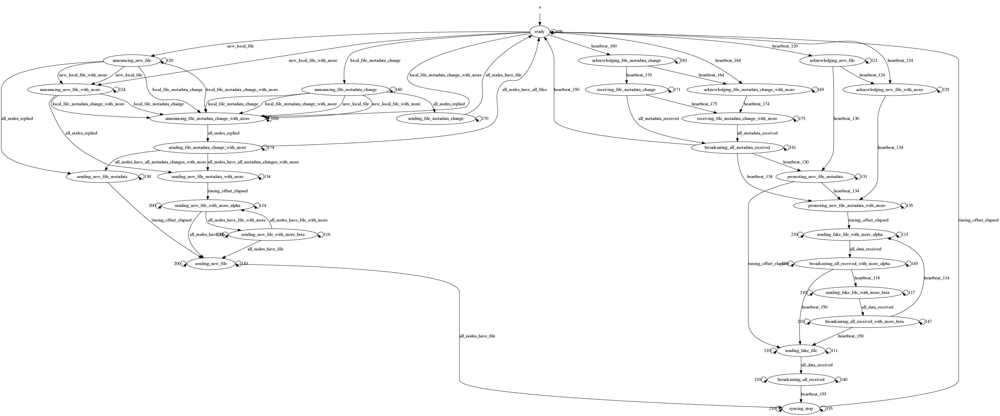

% Flock Protocol Specification
% Alexander Herr
% 2016

This document describes Flock, a traffic analysis resistant multi-user file-transfer protocol. It is designed to hide information regarding who shared files with whom in a (local) network by increasing the bandwidth usage of all nodes participating. 

* author: Alexander Herr
* copyright: Alexander Herr 2016
* version: 1.0.0

# Preamble

This Specification is free software; you can redistribute it and/or modify it under the terms of the GNU General Public License as published by the Free Software Foundation; either version 3 of the License, or (at your option) any later version. This Specification is distributed in the hope that it will be useful, but WITHOUT ANY WARRANTY; without even the implied warranty of MERCHANTABILITY or FITNESS FOR A PARTICULAR PURPOSE. See the GNU General Public License for more details. You should have received a copy of the GNU General Public License along with this program; if not, see <http://www.gnu.org/licenses>.

As an additional note, this license only covers the specification text itself, not implementations. Derived code can be licensed under any license. However derived versions of this specification must be shared under the GPL (as outlined above). The goal of this is to prevent private extensions of this specification.

The key words "MUST", "MUST NOT", "REQUIRED", "SHALL", "SHALL NOT", "SHOULD", "SHOULD NOT", "RECOMMENDED", "MAY", and "OPTIONAL" in this document are to be interpreted as described in RFC 2119[@rfc2119].

# Flock Specification

Flock is a protocol aiming to hide all information disclosing a sender or receiver of files that are shared on a (semi-)local network, including all information about the files shared, thereby protecting them from adverse traffic analysis attacks. It is designed to be applicable to any messaging and transport layer, but requires the use of a cryptographically secure library providing confidentiality and integrity as well as providing protection against replay attacks. 

## General Concept

Every node continuously sends heartbeat packages to all other nodes in the network. These indicate the current state of a node and provide metainformation to synchronize the network. When a node wants to share a file across the network their state changes and their heartbeat packages indicate that new state. All other nodes react on that change and subsequently enter a state where they accept new files. When all nodes have changed into the correct state for file transfer, the sending node provides meta information for the file to be transferred in a specially crafted heartbeat. Note that all heartbeat packets are defined to be indistinguishable when analysed without the cryptographic keys to decrypt them. 

After a randomized timing offset, all nodes change into a file transfer state where they start sending large amounts of data. Only the sharing node sends the real content of the new file. Once every node received all parts of the file, file transfer stops. 

## Terminology

**FSM**
  : FSM is short for (deterministic) finite-state machine and refers to the computational model of the same name, in which a program has certain, well-defined states, which it changes between according to well-defined actions, after receiving well-defined events. 

**state**
  : A state is a technical term of FSMs and refers to a certain instant in time in which a program has access to certain information, including well-defined events it SHALL react to. 

**event**
  : An event is a technical term of FSMs and refers to certain input for a program, processed by the program according to its current state. 

**action**
  : An action is a technical term of FSMs and refers to certain output for a program, processed by the program according to its current state. 

**status (code)**
  : A status or status code is a textual representation of states, events, and actions consisting of three (3) characters. 

**client**
  : A client is any application implementing the Flock protocol and communicating with other clients. For most parts of this specification, the terms clients and nodes are used synonymously. 

**node**
  : A node is any machine communicating over a network using the Flock protocol and refers mostly to a conceptual node in a conceptual network. For most parts of this specification, the terms clients and nodes are used synonymously. 

**heartbeat**
  : A heartbeat is a message of a specific (short) length, sent regularly by a node regardless of its internal state. It is expected to be received by other nodes and interpreted accordingly. 

**metadata**
  : Metadata refers to any information detailing other information, e.g. encoding information for a file containing picture information. 

**file content data**
  : File content data, file data, or content data refers to binary information stored inside a given file. 

**hash**
  : A hash is a 256 bit long number that can be used to uniquely identify shared information, e.g. a client's base-path of a file, that is sufficiently unique and can be generated on all connected nodes equally. Hashes should be generated using cryptographic hashing algorithms, to limit the impact of collisions. 

## Requirements

### Cryptographic Messaging Layer

The Flock protocol needs to be implemented on top of a secure cryptographic messaging layer. The purpose of this protocol is to define how messages are to be encoded and under which circumstances they are to be sent. It does not specify how clients are to communicate and, therefore, does not mandate how the messages transported are to be secured. 

In particular, the Flock protocol requires that the cryptographic messaging layer provides the following security properties:

* **Confidentiality** of all messages as defined by the protocol against espionage, 
* **Integrity** of all messages as defined by the protocol against corruption and forgery, 
* **Authentication** of all participating nodes, 
* **Replay Attack Protection** of all messages sent, 
* **Man-in-the-middle Attack Protection** of all messages sent,
* **Forward Secrecy** of all messages sent. 

## Threat Model

This chapter outlines the threat model of Flock and is inspired by the threat model of SecureDrop. Maybe, someday, we have a unified system to describe threat models for security protocols and applications that are concise and complementary to a cryptanalytical threat analysis. The threat model is defined in terms of what each possible adversary can achieve. 

Both assumptions and attacks are relatively sparse as both are heavily reliant on specific implementation details, including but not limited to the security provided by the messaging layer. 

### Assumptions

#### Assumptions about the User

* The user acts reasonably and in good faith.
* The user wants to remain anonymous when sending files. 
* The user wants to remain anonymous when receiving files. 

#### Assumptions about the User's Computer

* The user's computer correctly executes its OS and any application, including the Flock client. 
* The user's computer is not compromised to a point, where Flock messages can be read in decrypted form. 
* The user's computer is not compromised to a point, where access to the directory where transmitted files reside is available for any compromised process. 

#### Assumptions about the Network

* None.

#### Assumptions about the World

* The security assumptions of the used cryptographic messaging layers are correct. 
* The security assumptions of the used hashing algorithm is correct. 

### Attack Scenarios

#### What Non-Participating and Non-Adversarial Regular Users (Others) of the same Network can achieve

* Others can decrease network bandwidth for Flock through personal use of the network. 
* Others can limit throughput to individual users of Flock through use of other network messaging applications, thereby increasing the individuals latency towards Flock. 

#### What Non-Participating and Non-Adversarial Administrators (Admins) of the same Network can achieve

* Admins can limit bandwidth availability for all Flock nodes. 
* Admins can limit bandwidth availability for specific Flock nodes. 
* Admins can impact latency for all Flock nodes. 
* Admins can impact latency for specific Flock nodes. 
* Admins can limit available ports. 
* Admins can ban IP- and/or MAC-addresses of known Flock nodes. 

#### What Local Network Adversaries (LNA) can achieve

* LNA's can read all packages sent over the local network, including their content. 
* LNA's can observe and identify users communicating through Flock in the local network. 
* LNA's can observe when file content data is synchronised over the local network. 
* LNA's can block all Flock traffic in the local network. 
* LNA's can block individual Flock traffic of individual users in the local network. 
* LNA's can block specific messages of all Flock traffic in the local network. 
* LNA's can block specific messages of individual Flock traffic of individual users in the local network. 

#### What Global Network Adversaries (GNA) can achieve

* GNA's can read all packages sent, including their content. 
* GNA's can observe and identify users communicating through Flock. 
* GNA's can observe when file content data is synchronised. 
* GNA's can block all Flock traffic. 
* GNA's can block individual Flock traffic of individual users. 
* GNA's can block specific messages of all Flock traffic. 
* GNA's can block specific messages of individual Flock traffic of individual users. 

#### What Authenticated Adversaries (AA) can achieve

* AA's are functionally equal to regular user, i.e. they can completely subvert any security. 

# Protocol states

A client implementing Flock SHALL idle in a 'Ready' state, where it sends regular heartbeat packages to all connected nodes and waits for either of two events happening: (a) the client itself wants to share a file or (b) another node wants to share a file by sending a corresponding status code in their heartbeats. The state change flow of the client is illustrated in @fig:flockfsm:

{#fig:flockfsm}

## Idle state and general heartbeat message concept

If no file transfer is in progress the client SHALL send heartbeat messages at semi-regular intervals. These messages SHALL begin with a status code of `100`. These heartbeat messages SHALL contain data as defined in @sec:idle-heartbeat-message-100150.

All heartbeat messages MUST have the same length and SHALL be sent about 4 times per second at semi-regular intervals. These intervals SHALL be individually offset by plus/minus 25 milliseconds so as to provide high-level regularity and low-level unpredictability; this specification will henceforth only use the high-level notion of this semi-regularity of transmission intervals, i.e. where it is stated that heartbeat messages SHALL be send at regular intervals the semi-regularity as described in this paragraph is assumed. 

## Sending files

### Sending one file with contents

If one file with its contents is to be shared the client SHALL send heartbeat messages at regular intervals beginning with a status code of `120`. These heartbeat messages SHALL contain data as defined in @sec:announcement-heartbeat-message-120121124125160161164165. The client SHALL stay in this state until all other nodes currently connected to send heartbeat messages with a status code of `121` before proceeding. 

If the client then received heartbeat messages with a status code of `121` from all other nodes, it SHALL send heartbeat messages at regular intervals beginning with a status code of `130`. These heartbeat messages SHALL contain data as defined in @sec:file-metadata-with-content-heartbeat-message-130131134135 including a randomly chosen timepoint of 3 to 6 seconds in the future. This timepoint SHALL additionally be offset by an individual plus/minus 25 milliseconds. Once this timepoint has been reached the client SHALL proceed and start sending the contents of the file. 

A client starting to send a file SHALL send heartbeat messages at regular intervals beginning with a status code of `110` and SHALL contain data as defined in @sec:sending-file-heartbeat-message-110111114115116117. Simultaneously the client SHALL send file messages beginning with a status code of `200` as fast as possible, but not faster or slower than a client sending fake file messages. The file messages SHALL contain data as defined in @sec:file-data-message-200. The client SHALL send these messages until it received a heartbeat message with a status code of `140` from every receiving node, in which case the client SHALL send heartbeat messages beginning with a status code of `155`. These heartbeat messages SHALL contain data as defined in @sec:sync-stop-heartbeat-message-155 including a randomly chosen timepoint of 1 to 2 seconds in the future. This timepoint SHALL additionally be offset by an individual plus/minus 25 milliseconds. Once this timepoint has been reached the client SHALL stop sending the file data messages.

The client SHALL then send at least one heartbeat message beginning with a status code of `150` and return to its idle state. A heartbeat message with a status code of `150` SHALL contain data as defined in @sec:idle-heartbeat-message-100150.

A client sending a file SHALL stop sending file data messages if another node sent 3 consecutive heartbeat messages with a status of either `110` or `140` without sending any file data messages. In such a case the client SHALL send a heartbeat message with a status of `410` and return to its idle state. A heartbeat message with a status code of `410` SHALL contain data as defined in @sec:node-only-sends-heartbeats-error-410.

### Sending multiple files with contents

If multiple files with their contents are to be shared the client SHALL send heartbeat messages at regular intervals beginning with a status code of `124`. These heartbeat messages SHALL contain data as defined in @sec:announcement-heartbeat-message-120121124125160161164165. Th client SHALL stay in this state until all other nodes currently connected to send heartbeat messages with a status code of `125` before proceeding. 

If the client then received heartbeat messages with a status code of `125` from all other nodes, it SHALL send heartbeat messages at regulat intervals beginning with a status code of `134`. These heartbeat messages SHALL contain data as defined in @sec:file-metadata-with-content-heartbeat-message-130131134135. including a randomly chosen timepoint of 3 to 6 seconds in the future. This timepoint SHALL additionally be offset by an individual plus/minus 25 milliseconds. Once this timepoint has been reached the client SHALL proceed and start sending the contents of the file. 

A client starting to send a file SHALL send heartbeat messages at regular intervals beginning with a status code of `114` and SHALL contain data as defined in @sec:sending-file-heartbeat-message-110111114115116117. Simultaneously the client SHALL send file messages beginning with a status code of `200` as fast as possible, but not faster or slower than a client sending fake file messages. The file messages SHALL contain data as defined in @sec:file-data-message-200. The client SHALL send these messages until it received a heartbeat message with a status code of `145` from every receiving node, in which case the client SHALL send the next file. The client SHALL send heartbeat messages at regular intervals beginning with a status code of `116` and SHALL contain data as defined in @sec:sending-file-heartbeat-message-110111114115116117. Simultaneously the client SHALL send file messages beginning with a status code of `200` as fast as possible, but not faster or slower than a client sending fake file messages. The file messages SHALL contain data as defined in @sec:file-data-message-200. The client SHALL send these messages until it received a heartbeat message with a status code of `147` from every receiving node. If the sending client has files left to transmit it SHALL return to its previous state and send heartbeat messages at regular intervals beginning with a status code of `114`. For as long as the sending node has files left for transfer it SHALL switch between sending heartbeat messages with a status code of `114` and `116`, at each switch proceeding to the next file left for transfer. 

If the client has only one more file left to transfer it SHALL send heartbeat messages at regular intervals beginning with a status code of `110` and SHALL contain data as defined in @sec:sending-file-heartbeat-message-110111114115116117. Simultaneously the client SHALL send file messages beginning with a status code of `200` as fast as possible, but not faster or slower than a client sending fake file messages. The file messages SHALL contain data as defined in @sec:file-data-message-200. The client SHALL send these messages until it received a heartbeat message with a status code of `140` from every receiving node, in which case the client SHALL send heartbeat messages beginning with a status code of `155`. These heartbeat messages SHALL contain data as defined in @sec:sync-stop-heartbeat-message-155 including a randomly chosen timepoint of 1 to 2 seconds in the future. This timepoint SHALL additionally be offset by an individual plus/minus 25 milliseconds. Once this timepoint has been reached the client SHALL stop sending the file data messages.

The client SHALL then send at least one heartbeat message beginning with a status code of `150` and return to its idle state. A heartbeat message with a status code of `150` SHALL contain data as defined in @sec:idle-heartbeat-message-100150.

A client sending a file SHALL stop sending file data messages if another node sent 3 consecutive heartbeat messages with a status of either `110` or `140` without sending any file data messages. In such a case the client SHALL send a heartbeat message with a status of `410` and return to its idle state. A heartbeat message with a status code of `410` SHALL contain data as defined in @sec:node-only-sends-heartbeats-error-410.

### Sending metadata change of one file

If the metadata change of one file (including the file's creation and/or deletion) is to be shared the client SHALL send heartbeat messages at regular intervals beginning with a status code of `160`. These heartbeat messages SHALL contain data as defined in @sec:announcement-heartbeat-message-120121124125160161164165. The client SHALL stay in this state until all other nodes currently connected to send heartbeat messages with a status code of `161` before proceeding. 

If the client then received heartbeat messages with a status code of `161` from all other nodes, it SHALL send heartbeat messages at regular intervals beginning with a status code of `170`. These heartbeat messages SHALL contain data as defined in @sec:file-metadata-without-content-heartbeat-message-170171174175. The client SHALL send these messages until it received a heartbeat message with a status code of `141` from every receiving node, in which case the client SHALL send at least one heartbeat message beginning with a status code of `150` and return to its idle state. A heartbeat message with a status code of `150` SHALL contain data as defined in @sec:idle-heartbeat-message-100150.

### Sending metadata change of multiple files

If the metadata change of multiple files (including the file's creation and/or deletion) is to be shared the client SHALL send heartbeat messages at regular intervals beginning with a status code of `164`. These heartbeat messages SHALL contain data as defined in @sec:announcement-heartbeat-message-120121124125160161164165. The client SHALL stay in this state until all other nodes currently connected to send heartbeat messages with a status code of `165` before proceeding. 

If the client then received heartbeat messages with a status code of `165` from all other nodes, it SHALL send heartbeat messages at regular intervals beginning with a status code of `174`. These heartbeat messages SHALL contain data as defined in @sec:file-metadata-without-content-heartbeat-message-170171174175. The client SHALL send the metadata of all files successively during this state until all metadata changes have been sent at least once, the client SHALL repeat this process until it received a heartbeat message with a status code of `141` from every receiving node, in which case the client SHALL send at least one heartbeat message beginning with a status code of `150` and return to its idle state. A heartbeat message with a status code of `150` SHALL contain data as defined in @sec:idle-heartbeat-message-100150.

### Sending metadata change of multiple files with content

If the metadata change of multiple files (including the file's creation and/or deletion) is to be shared the client SHALL send heartbeat messages at regular intervals beginning with a status code of `164`. These heartbeat messages SHALL contain data as defined in @sec:announcement-heartbeat-message-120121124125160161164165. The client SHALL stay in this state until all other nodes currently connected to send heartbeat messages with a status code of `165` before proceeding. 

If the client then received heartbeat messages with a status code of `165` from all other nodes, it SHALL send heartbeat messages at regular intervals beginning with a status code of `174`. These heartbeat messages SHALL contain data as defined in @sec:file-metadata-without-content-heartbeat-message-170171174175. The client SHALL send the metadata of all files whose metadata is to be transferred successively during this state until all metadata changes have been sent at least once, the client SHALL repeat this process until it received a heartbeat message with a status code of `141` from every receiving node. 

If the client has multiple files with their content to be transferred it SHALL send heartbeat messages at regulat intervals beginning with a status code of `134`. These heartbeat messages SHALL contain data as defined in @sec:file-metadata-with-content-heartbeat-message-130131134135. including a randomly chosen timepoint of 3 to 6 seconds in the future. This timepoint SHALL additionally be offset by an individual plus/minus 25 milliseconds. Once this timepoint has been reached the client SHALL proceed and start sending the contents of the file. 

A client starting to send a file SHALL send heartbeat messages at regular intervals beginning with a status code of `114` and SHALL contain data as defined in @sec:sending-file-heartbeat-message-110111114115116117. Simultaneously the client SHALL send file messages beginning with a status code of `200` as fast as possible, but not faster or slower than a client sending fake file messages. The file messages SHALL contain data as defined in @sec:file-data-message-200. The client SHALL send these messages until it received a heartbeat message with a status code of `145` from every receiving node, in which case the client SHALL send the next file. The client SHALL send heartbeat messages at regular intervals beginning with a status code of `116` and SHALL contain data as defined in @sec:sending-file-heartbeat-message-110111114115116117. Simultaneously the client SHALL send file messages beginning with a status code of `200` as fast as possible, but not faster or slower than a client sending fake file messages. The file messages SHALL contain data as defined in @sec:file-data-message-200. The client SHALL send these messages until it received a heartbeat message with a status code of `147` from every receiving node. If the sending client has files left to transmit it SHALL return to its previous state and send heartbeat messages at regular intervals beginning with a status code of `114`. For as long as the sending node has files left for transfer it SHALL switch between sending heartbeat messages with a status code of `114` and `116`, at each switch proceeding to the next file left for transfer. 

If the client has only one more file left to transfer it SHALL send heartbeat messages at regular intervals beginning with a status code of `110` and SHALL contain data as defined in @sec:sending-file-heartbeat-message-110111114115116117. Simultaneously the client SHALL send file messages beginning with a status code of `200` as fast as possible, but not faster or slower than a client sending fake file messages. The file messages SHALL contain data as defined in @sec:file-data-message-200. The client SHALL send these messages until it received a heartbeat message with a status code of `140` from every receiving node, in which case the client SHALL send heartbeat messages beginning with a status code of `155`. These heartbeat messages SHALL contain data as defined in @sec:sync-stop-heartbeat-message-155 including a randomly chosen timepoint of 1 to 2 seconds in the future. This timepoint SHALL additionally be offset by an individual plus/minus 25 milliseconds. Once this timepoint has been reached the client SHALL stop sending the file data messages.

The client SHALL then send at least one heartbeat message beginning with a status code of `150` and return to its idle state. A heartbeat message with a status code of `150` SHALL contain data as defined in @sec:idle-heartbeat-message-100150.

A client sending a file SHALL stop sending file data messages if another node sent 3 consecutive heartbeat messages with a status of either `110` or `140` without sending any file data messages. In such a case the client SHALL send a heartbeat message with a status of `410` and return to its idle state. A heartbeat message with a status code of `410` SHALL contain data as defined in @sec:node-only-sends-heartbeats-error-410.

## Receiving files

### Receiving one file with contents

If the client received a heartbeat message with a status code of `120`, it SHALL send heartbeat messages at regular intervals beginning with a status code of `121`. These heartbeat messages SHALL contain data as defined in @sec:announcement-heartbeat-message-120121124125160161164165.

If the client then received a heartbeat message with a status code of `130`, it SHALL send heartbeat messages at regular intervals with a status code of `131`. These heartbeat messages SHALL contain data as defined in @sec:file-metadata-with-content-heartbeat-message-130131134135. The heartbeat messages received SHALL include a randomly chosen timepoint of 3 to 6 seconds in the future. This timepoint SHALL additionally be offset by an individual plus/minus 25 milliseconds. Once this timepoint has been reached the client SHALL proceed and start sending fake file messages. 

A client starting to receive file data messages SHALL send heartbeat messages at regular intervals beginning with a status code of `111` and SHALL contain data as defined in @sec:sending-file-heartbeat-message-110111114115116117. Simultaneously the client SHALL send fake file messages beginning with a status code of `210` as fast as possible, but not faster or slower than a client sending file data messages. The file messages SHALL contain data as defined in @sec:fake-file-message-210. The client SHALL remain in this state until it received all file data to reconstruct and store the file shared. 

If the client received all file data it SHALL send heartbeat messages at regular intervals beginning with a status code of `140`. These heartbeat messages SHALL contain data as defined in @sec:all-data-received-heartbeat-message-140141145147. Simultaneously the client SHALL send fake file messages beginning with a status code of `210` as fast as possible, but not faster or slower than a client sending file data messages. The file messages SHALL contain data as defined in @sec:fake-file-message-210. The client SHALL send these messages until it received a heartbeat message with a status code of `155` from the sending node. The client SHALL then send one heartbeat message beginning with a status code of `155`. These heartbeat messages SHALL contain data as defined in @sec:sync-stop-heartbeat-message-155. The heartbeat messages received from the sending node SHALL include a randomly chosen timepoint of 1 to 2 seconds in the future. This timepoint SHALL additionally be offset by an individual plus/minus 25 milliseconds. Once this timepoint has been reached the client SHALL stop sending the fake file messages.

The client SHALL then send at least one heartbeat message beginning with a status code of `150` and return to its idle state. A heartbeat message with a status code of `150` SHALL contain data as defined in @sec:idle-heartbeat-message-100150.

A client sending a file SHALL stop sending file data messages if another node sent 3 consecutive heartbeat messages with a status of either `110` or `140` without sending any file data messages. In such a case the client SHALL send a heartbeat message with a status of `410` and return to its idle state. A heartbeat message with a status code of `410` SHALL contain data as defined in @sec:node-only-sends-heartbeats-error-410.

### Receiving multiple files with contents

If the client received a heartbeat message with a status code of `124`, it SHALL send heartbeat messages at regular intervals beginning with a status code of `125`. These heartbeat messages SHALL contain data as defined in @sec:announcement-heartbeat-message-120121124125160161164165.

If the client then received a heartbeat message with a status code of `134`, it SHALL send heartbeat messages at regular intervals with a status code of `135`. These heartbeat messages SHALL contain data as defined in @sec:file-metadata-with-content-heartbeat-message-130131134135. The heartbeat messages received SHALL include a randomly chosen timepoint of 3 to 6 seconds in the future. This timepoint SHALL additionally be offset by an individual plus/minus 25 milliseconds. Once this timepoint has been reached the client SHALL proceed and start sending fake file messages. 

A client starting to receive file data messages SHALL send heartbeat messages at regular intervals beginning with a status code of `115` and SHALL contain data as defined in @sec:sending-file-heartbeat-message-110111114115116117. Simultaneously the client SHALL send fake file messages beginning with a status code of `210` as fast as possible, but not faster or slower than a client sending file data messages. The file messages SHALL contain data as defined in @sec:fake-file-message-210. The client SHALL remain in this state until it received all file data to reconstruct and store the file shared. 

If the client received all file data it SHALL send heartbeat messages at regular intervals beginning with a status code of `145`. These heartbeat messages SHALL contain data as defined in @sec:all-data-received-heartbeat-message-140141145147. Simultaneously the client SHALL send fake file messages beginning with a status code of `210` as fast as possible, but not faster or slower than a client sending file data messages. The file messages SHALL contain data as defined in @sec:fake-file-message-210. The client SHALL send these messages until it received a heartbeat message with a status code of `116` from the sending node, in which case the client SHALL receive the next file. 

A client starting to receive the next file data messages SHALL send heartbeat messages at regular intervals beginning with a status code of `117` and SHALL contain data as defined in @sec:sending-file-heartbeat-message-110111114115116117. Simultaneously the client SHALL send fake file messages beginning with a status code of `210` as fast as possible, but not faster or slower than a client sending file data messages. The file messages SHALL contain data as defined in @sec:fake-file-message-210. The client SHALL remain in this state until it received all file data to reconstruct and store the file shared. 

If the client received all file data it SHALL send heartbeat messages at regular intervals beginning with a status code of `147`. These heartbeat messages SHALL contain data as defined in @sec:all-data-received-heartbeat-message-140141145147. Simultaneously the client SHALL send fake file messages beginning with a status code of `210` as fast as possible, but not faster or slower than a client sending file data messages. The file messages SHALL contain data as defined in @sec:fake-file-message-210. The client SHALL send these messages until it received a heartbeat message with a status code of `117` from the sending node. If the sending client has files left to transmit it SHALL return to its previous state and send heartbeat messages at regular intervals beginning with a status code of `115`. For as long as the sending node has files left for transfer it SHALL switch between sending heartbeat messages with a status code of `115` and `117`, at each switch receiving the next file left for transfer. 

If the client received a heartbeat message with a status code of `130` after having received the last file's content, it SHALL send heartbeat messages at regular intervals beginning with a status code of `111` and SHALL contain data as defined in @sec:sending-file-heartbeat-message-110111114115116117. Simultaneously the client SHALL send fake file messages beginning with a status code of `210` as fast as possible, but not faster or slower than a client sending file data messages. The file messages SHALL contain data as defined in @sec:fake-file-message-210. The client SHALL remain in this state until it received all file data to reconstruct and store the file shared. 

If the client received all file data it SHALL send heartbeat messages at regular intervals beginning with a status code of `140`. These heartbeat messages SHALL contain data as defined in @sec:all-data-received-heartbeat-message-140141145147. Simultaneously the client SHALL send fake file messages beginning with a status code of `210` as fast as possible, but not faster or slower than a client sending file data messages. The file messages SHALL contain data as defined in @sec:fake-file-message-210. The client SHALL send these messages until it received a heartbeat message with a status code of `155` from the sending node. The client SHALL then send one heartbeat message beginning with a status code of `155`. These heartbeat messages SHALL contain data as defined in @sec:sync-stop-heartbeat-message-155. The heartbeat messages received from the sending node SHALL include a randomly chosen timepoint of 1 to 2 seconds in the future. This timepoint SHALL additionally be offset by an individual plus/minus 25 milliseconds. Once this timepoint has been reached the client SHALL stop sending the fake file messages.

The client SHALL then send at least one heartbeat message beginning with a status code of `150` and return to its idle state. A heartbeat message with a status code of `150` SHALL contain data as defined in @sec:idle-heartbeat-message-100150.

A client sending a file SHALL stop sending file data messages if another node sent 3 consecutive heartbeat messages with a status of either `110` or `140` without sending any file data messages. In such a case the client SHALL send a heartbeat message with a status of `410` and return to its idle state. A heartbeat message with a status code of `410` SHALL contain data as defined in @sec:node-only-sends-heartbeats-error-410.

### Receiving metadata change of one file

If the client received a heartbeat message with a status code of `160`, it SHALL send heartbeat messages at regular intervals beginning with a status code of `161`. These heartbeat messages SHALL contain data as defined in @sec:announcement-heartbeat-message-120121124125160161164165. 

If the client then received a heartbeat messages with a status code of `170` from the sending node, it SHALL send heartbeat messages at regular intervals beginning with a status code of `171`. These heartbeat messages SHALL contain data as defined in @sec:file-metadata-without-content-heartbeat-message-170171174175. If the client received all file data it SHALL send heartbeat messages at regular intervals beginning with a status code of `141`. These heartbeat messages SHALL contain data as defined in @sec:all-data-received-heartbeat-message-140141145147. 

The client SHALL send these messages until it received a heartbeat message with a status code of `150` from the sending node, in which case the client SHALL send at least one heartbeat message beginning with a status code of `150` and return to its idle state. A heartbeat message with a status code of `150` SHALL contain data as defined in @sec:idle-heartbeat-message-100150.

### Receiving metadata change of multiple file

If the client received a heartbeat message with a status code of `164`, it SHALL send heartbeat messages at regular intervals beginning with a status code of `165`. These heartbeat messages SHALL contain data as defined in @sec:announcement-heartbeat-message-120121124125160161164165. 

If the client then received a heartbeat messages with a status code of `174` from the sending node, it SHALL send heartbeat messages at regular intervals beginning with a status code of `175`. These heartbeat messages SHALL contain data as defined in @sec:file-metadata-without-content-heartbeat-message-170171174175. The client SHALL receive the metadata of all files successively during this state until all metadata changes have been sent at least once. If the client received all file data it SHALL send heartbeat messages at regular intervals beginning with a status code of `141`. These heartbeat messages SHALL contain data as defined in @sec:all-data-received-heartbeat-message-140141145147. 

The client SHALL send these messages until it received a heartbeat message with a status code of `150` from the sending node, in which case the client SHALL send at least one heartbeat message beginning with a status code of `150` and return to its idle state. A heartbeat message with a status code of `150` SHALL contain data as defined in @sec:idle-heartbeat-message-100150.

### Receiving metadata change of multiple file with content

If the client received a heartbeat message with a status code of `164`, it SHALL send heartbeat messages at regular intervals beginning with a status code of `165`. These heartbeat messages SHALL contain data as defined in @sec:announcement-heartbeat-message-120121124125160161164165. 

If the client then received a heartbeat messages with a status code of `174` from the sending node, it SHALL send heartbeat messages at regular intervals beginning with a status code of `175`. These heartbeat messages SHALL contain data as defined in @sec:file-metadata-without-content-heartbeat-message-170171174175. The client SHALL receive the metadata of all files successively during this state until all metadata changes have been sent at least once. If the client received all file data it SHALL send heartbeat messages at regular intervals beginning with a status code of `141`. These heartbeat messages SHALL contain data as defined in @sec:all-data-received-heartbeat-message-140141145147. 

If the client then received a heartbeat message with a status code of `134`, it SHALL send heartbeat messages at regular intervals with a status code of `135`. These heartbeat messages SHALL contain data as defined in @sec:file-metadata-with-content-heartbeat-message-130131134135. The heartbeat messages received SHALL include a randomly chosen timepoint of 3 to 6 seconds in the future. This timepoint SHALL additionally be offset by an individual plus/minus 25 milliseconds. Once this timepoint has been reached the client SHALL proceed and start sending fake file messages. 

A client starting to receive file data messages SHALL send heartbeat messages at regular intervals beginning with a status code of `115` and SHALL contain data as defined in @sec:sending-file-heartbeat-message-110111114115116117. Simultaneously the client SHALL send fake file messages beginning with a status code of `210` as fast as possible, but not faster or slower than a client sending file data messages. The file messages SHALL contain data as defined in @sec:fake-file-message-210. The client SHALL remain in this state until it received all file data to reconstruct and store the file shared. 

If the client received all file data it SHALL send heartbeat messages at regular intervals beginning with a status code of `145`. These heartbeat messages SHALL contain data as defined in @sec:all-data-received-heartbeat-message-140141145147. Simultaneously the client SHALL send fake file messages beginning with a status code of `210` as fast as possible, but not faster or slower than a client sending file data messages. The file messages SHALL contain data as defined in @sec:fake-file-message-210. The client SHALL send these messages until it received a heartbeat message with a status code of `116` from the sending node, in which case the client SHALL receive the next file. 

A client starting to receive the next file data messages SHALL send heartbeat messages at regular intervals beginning with a status code of `117` and SHALL contain data as defined in @sec:sending-file-heartbeat-message-110111114115116117. Simultaneously the client SHALL send fake file messages beginning with a status code of `210` as fast as possible, but not faster or slower than a client sending file data messages. The file messages SHALL contain data as defined in @sec:fake-file-message-210. The client SHALL remain in this state until it received all file data to reconstruct and store the file shared. 

If the client received all file data it SHALL send heartbeat messages at regular intervals beginning with a status code of `147`. These heartbeat messages SHALL contain data as defined in @sec:all-data-received-heartbeat-message-140141145147. Simultaneously the client SHALL send fake file messages beginning with a status code of `210` as fast as possible, but not faster or slower than a client sending file data messages. The file messages SHALL contain data as defined in @sec:fake-file-message-210. The client SHALL send these messages until it received a heartbeat message with a status code of `117` from the sending node. If the sending client has files left to transmit it SHALL return to its previous state and send heartbeat messages at regular intervals beginning with a status code of `115`. For as long as the sending node has files left for transfer it SHALL switch between sending heartbeat messages with a status code of `115` and `117`, at each switch receiving the next file left for transfer. 

If the client received a heartbeat message with a status code of `130`, it SHALL send heartbeat messages at regular intervals beginning with a status code of `111` and SHALL contain data as defined in @sec:sending-file-heartbeat-message-110111114115116117. Simultaneously the client SHALL send fake file messages beginning with a status code of `210` as fast as possible, but not faster or slower than a client sending file data messages. The file messages SHALL contain data as defined in @sec:fake-file-message-210. The client SHALL remain in this state until it received all file data to reconstruct and store the file shared. 

If the client received all file data it SHALL send heartbeat messages at regular intervals beginning with a status code of `140`. These heartbeat messages SHALL contain data as defined in @sec:all-data-received-heartbeat-message-140141145147. Simultaneously the client SHALL send fake file messages beginning with a status code of `210` as fast as possible, but not faster or slower than a client sending file data messages. The file messages SHALL contain data as defined in @sec:fake-file-message-210. The client SHALL send these messages until it received a heartbeat message with a status code of `155` from the sending node. The client SHALL then send one heartbeat message beginning with a status code of `155`. These heartbeat messages SHALL contain data as defined in @sec:sync-stop-heartbeat-message-155. The heartbeat messages received from the sending node SHALL include a randomly chosen timepoint of 1 to 2 seconds in the future. This timepoint SHALL additionally be offset by an individual plus/minus 25 milliseconds. Once this timepoint has been reached the client SHALL stop sending the fake file messages.

The client SHALL then send at least one heartbeat message beginning with a status code of `150` and return to its idle state. A heartbeat message with a status code of `150` SHALL contain data as defined in @sec:idle-heartbeat-message-100150.

A client sending a file SHALL stop sending file data messages if another node sent 3 consecutive heartbeat messages with a status of either `110` or `140` without sending any file data messages. In such a case the client SHALL send a heartbeat message with a status of `410` and return to its idle state. A heartbeat message with a status code of `410` SHALL contain data as defined in @sec:node-only-sends-heartbeats-error-410.

# Status codes

* Heartbeat codes `1xx` (informational)
    - `100` **idle** heartbeat message
    - `110` **sending new file** heartbeat message
    - `111` **sending fake file** heartbeat message
    - `114` **sending new file with more** heartbeat message
    - `115` **sending fake file with more** heartbeat message
    - `116` **sending new file with more** heartbeat message
    - `117` **sending fake file with more** heartbeat message
    - `120` **announcing** heartbeat message
    - `121` **accepting** heartbeat message
    - `124` **announcing new file with more** heartbeat message
    - `125` **acknowledging new file with more** heartbeat message
    - `130` **sending new file metadata** heartbeat message
    - `131` **promoting new file metadata** heartbeat message
    - `134` **sending new file metadata with more** heartbeat message
    - `135` **promoting new file metadata with more** heartbeat message
    - `140` **broadcasting all received** heartbeat message
    - `141` **broadcasting all metadata received** heartbeat message
    - `145` **broadcasting all received with more** heartbeat message
    - `147` **broadcasting all received with more** heartbeat message
    - `150` **transfer finished** heartbeat message
    - `155` **syncing stop** heartbeat message
    - `160` **announcing file metadata change** heartbeat message
    - `161` **acknowledging file metadata change** heartbeat message
    - `164` **announcing file metadata change with more** heartbeat message
    - `165` **acknowledging file metadata change with more** heartbeat message
    - `170` **sending file metadata change** heartbeat message
    - `171` **receiving file metadata change** heartbeat message
    - `174` **sending file metadata change with more** heartbeat message
    - `175` **receiving file metadata change with more** heartbeat message


* File transfer codes `2xx` (transferring)
    - `200` **file data** message
    - `210` **fake file** message

* Error codes `4xx` (warning)
    - `410` **node only sends heartbeats** error heartbeat message

* Internal codes
    - `112` **file send tick** event
    - `113` **all data received** event
    - `122` **all nodes replied** event
    - `126` **all nodes replied** event
    - `132` **timing offset elapsed** event
    - `136` **timing offset elapsed** event
    - `142` **all nodes have file** event
    - `146` **all nodes have file with more** event
    - `156` **timing offset elapsed** event
    - `162` **all nodes replied** event
    - `166` **all nodes replied** event
    - `172` **all nodes have file** event
    - `173` **all metadata received** event
    - `177` **all nodes have all metadata changes with more** event
    - `178` **all nodes have all metadata changes with more** event
    - `300` **new local file** event
    - `304` **new local file with more** event
    - `320` **local file metadata change** event
    - `324` **local file metadata change with more** event
    - `500` **interrupt** event

# Message structure

The Flock protocol is a binary messaging protocol with a 4-byte long header representing the status code and therefore content of its respective message. The first byte SHALL be a number in the range of `1..5` representing the `type` of message. The types are:

* `1` heartbeat messages, 
* `2` file data messages, 
* `3` filesystem messages, 
* `4` network-error messages, 
* `5` client-error messages. 

The second and third bytes SHALL each be a number in the range of `0..8` representing type-specific `classification` and `modifier` of the message. The complete triplet of the first three bytes SHALL be considered a unique status code. Depending on the current state of the client a status code MAY be silently *accepted*, conditionally altering or advancing the current state of the client, *declined*, conditionally changing the clients state into a error-sending state warning other nodes, or *ignored* by the client. All not specifically handled statuses SHALL be *ignored*. The three-byte-long status code is to be followed by the space character, i.e. ASCII-code 0x20. The next 8 bytes is an unsigned long long integer (i.e. uin64_t) representing the milliseconds since Epoch of the message, i.e. the message's timestamp in milliseconds. All bytes following are encoded according to their specific purpose and message type. 

All messages are explained in prose and given a representation in ABNF[@rfc5234]. 

## Heartbeat messages

Heartbeat messages are 256 bytes long, disregarding the content of the actual heartbeat message (which might even be empty). This is not counting any information added by the transport and encryption mechanisms used. This length is dependent on the maximum number of nodes any one client was connected to for a certain window of time. If a client is connected to more than 15 nodes, it SHALL send the unique node identifiers consecutively in batches of 15 across as many heartbeats as necessary. 

### idle heartbeat message (100|150)

The idle heartbeats have a `100`, representing the default and start state, or `150`, representing that all previous states have positively ended and the client is returning to the default state, status code. The next 8 bytes is an unsigned long long integer (i.e. uin64_t) representing the milliseconds since Epoch of the message, i.e. the message's timestamp in milliseconds and is followed by a 1-byte unsigned integer representing the number of nodes currently connected to the client sending the heartbeat, followed by an array of 16-byte long unique node identifiers. If a client is connected to more than 15 nodes, it SHALL send the unique node identifiers consecutively in batches of 15 across as many heartbeats as necessary.  

ABNF: 
```BNF
idle-heartbeat = idle-status WSP timestamp node-count node-uid-batch
idle-status    = ("100" / "150")
timestamp      = 8 OCTET
node-count     = 1 OCTET
node-uid-batch = 1*15 node-uid
node-uid       = 16 OCTET
```

### sending file heartbeat message (110|111|114|115|116|117)

The sending heartbeats have either a `110`, `111`, `114`, `115`, `116` or `117` status code (see section @sec:protocol-states for differences in meaning). The next 8 bytes is an unsigned long long integer (i.e. uin64_t) representing the milliseconds since Epoch of the message, i.e. the message's timestamp in milliseconds followed by a 1-byte unsigned integer representing the number of nodes that are receiving file transfer messages and by an array of 16-byte long unique node identifiers. If a client is connected to more than 15 nodes, it SHALL send the unique node identifiers consecutively in batches of 15 across as many heartbeats as necessary.  

ABNF: 
```BNF
sending-heartbeat = sending-status WSP timestamp node-count \
                    node-uid-batch
sending-status    = ("110" / "111" / "114" / "115" / "116" / "117")
timestamp         = 8 OCTET
node-count        = 1 OCTET
node-uid-batch    = 1*15 node-uid
node-uid          = 16 OCTET
```

### announcement heartbeat message (120|121|124|125|160|161|164|165)

The announcement heartbeats have either a "120", "121", "124", "125", "160", "161", "164" or "165" status code (see section @sec:protocol-states for differences in meaning). The next 8 bytes is an unsigned long long integer (i.e. uin64_t) representing the milliseconds since Epoch of the message, i.e. the message's timestamp in milliseconds followed by a 1-byte unsigned integer representing the number of nodes that are to receive file transfer messages and by an array of 16-byte long unique node identifiers. If a client is connected to more than 15 nodes, it SHALL send the unique node identifiers consecutively in batches of 15 across as many heartbeats as necessary.  

ABNF: 
```BNF
announcing-heartbeat = announcing-status WSP timestamp node-count \
                       node-uid-batch
announcing-status    = ("120" / "121" / "124" / "125" / "160" / "161" \ 
                        / "164" / "165")
timestamp            = 8 OCTET
node-count           = 1 OCTET
node-uid-batch       = 1*15 node-uid
node-uid             = 16 OCTET
```

### file metadata with content heartbeat message (130|131|134|135)

The file metadata heartbeats with content have either a "130", "131", "134" or "135" status code (see section @sec:sending-files for differences in meaning). The next 8 bytes is an unsigned long long integer (i.e. uin64_t) representing the milliseconds since Epoch of the message, i.e. the message's timestamp in milliseconds followed by serialized file metadata and 8 bytes of an unsigned long long integer (i.e. uin64_t) indicating a timepoint in the future represented by the milliseconds since Epoch, i.e. the file-transfer's timepoint in milliseconds. The file metadata consists of a 32 byte long unique base-path identifier, a 32 byte long unique subdirectory identifier, 128-bytes representing the path of the file relative to the base-path, a 2-byte unsigned integer as the file's permission flags, a 1-byte integer representing the file-type, a 4-byte unsigned integer storing the file's modification time in seconds since Epoch and an 8-byte unsigned integer representing the file's size in bytes. 

ABNF: 
```BNF
md-content-heartbeat = md-content-status WSP timestamp file-md-simple timestamp
md-content-status    = ("130" / "131" / "134" / "135")
timestamp            = 8 OCTET
file-md-simple       = base-path subdir name mode type mtime size
base-path            = 32 OCTET
subdir               = 32 OCTET
name                 = 128 VCHAR
mode                 = 2 OCTET
type                 = 1 OCTET
mtime                = 4 OCTET
size                 = 8 OCTET
```

### file metadata without content heartbeat message (170|171|174|175)

The file metadata heartbeats without content have either a "170", "171", "174" or "175" status code (see section @sec:sending-files for differences in meaning). The next 8 bytes is an unsigned long long integer (i.e. uin64_t) representing the milliseconds since Epoch of the message, i.e. the message's timestamp in milliseconds followed by serialized file metadata. The file metadata consists of a 32 byte long unique base-path identifier, a 32 byte long unique subdirectory identifier and 128-bytes representing the path of the file relative to the base-path. The following metadata is either 9 characters spelling "IN_DELETE" or a 2-byte unsigned integer as the file's permission flags, a 1-byte integer representing the file-type, a 4-byte unsigned integer storing the file's modification time in seconds since Epoch and an 8-byte unsigned integer representing the file's size in bytes. 

ABNF: 
```BNF
metadata-heartbeat = metadata-status WSP timestamp file-metadata timestamp
metadata-status    = ("170" / "171" / "174" / "175")
timestamp          = 8 OCTET
file-metadata      = base-path subdir name (delete / (mode type mtime size))
base-path          = 32 OCTET
subdir             = 32 OCTET
name               = 128 VCHAR
delete             = "IN_DELETE"
mode               = 2 OCTET
type               = 1 OCTET
mtime              = 4 OCTET
size               = 8 OCTET
```

### all data received heartbeat message (140|141|145|147)

The all data received heartbeats have either a "140", "141", "144" or "145" status code (see section @sec:protocol-states for differences in meaning). The next 8 bytes is an unsigned long long integer (i.e. uin64_t) representing the milliseconds since Epoch of the message, i.e. the message's timestamp in milliseconds.

ABNF: 
```BNF
announcing-heartbeat = announcing-status WSP timestamp
announcing-status    = ("140" / "141" / "144" / "145")
timestamp            = 8 OCTET
```

### sync stop heartbeat message (155)

The sync stop heartbeats have a "155" status code. The next 8 bytes is an unsigned long long integer (i.e. uin64_t) representing the milliseconds since Epoch of the message, i.e. the message's timestamp in milliseconds followed by a 8-byte unsigned long long integer (i.e. uin64_t) indicating a timepoint in the future represented by the milliseconds since Epoch, i.e. the file-transfer's synchronized timepoint to stop in milliseconds

ABNF: 
```BNF
sync-stop-heartbeat = sync-stop-status WSP timestamp timestamp
sync-stop-status    = "155"
timestamp           = 8 OCTET
```

## File transfer messages

File transfer messages are always 4117 bytes long. This is not counting any information added by the transport and encryption mechanisms used. 

### file data message (200)

The file data messages have a "200" status code. The next 8 bytes is an unsigned long long integer (i.e. uint64_t) representing the data's offset in bytes in the file, another 8 bytes of an unsigned long long integer (i.e. uint64_t) representing the size in bytes of the data to write, 1 byte of an integer indicating if more data is to be transferred (with `1` indicating more data, `0` indicating the last data package). This is followed be 4096 bytes of file data. If the data package of the file is less than 4096 bytes the rest is filled with random data. Note that the randomization of the extra bytes might also be handled entirely by the underlying encryption of the messages, thus the data might also be filled with predictable, uniform bytes. 

ABNF: 
```BNF
file-data-message = file-data-status WSP offset size more data
file-data-status  = "200"
offset            = 8 OCTET
size              = 8 OCTET
more              = 1 OCTET
data              = 4096 OCTET
```

### fake file message (210)

The fake file messages have a "210" status code. It is followed by 4113 bytes of random data. Note that the randomization of the bytes might also be handled entirely by the underlying encryption of the messages, thus the data might also be filled with predictable, uniform bytes. 

ABNF: 
```BNF
fake-file-message = fake-file-status WSP random-data
fake-file-status  = "210"
random-data       = 4113 OCTET
```

## Error code messages

Error code messages are to be indistinguishable from heartbeat messages and follow therefore the same encoding principles, in particular with regards to length requirements. 

### node only sends heartbeats error (410)

The node only sends heartbeats error messages have a `410` status code. The next 8 bytes is an unsigned long long integer (i.e. uin64_t) representing the milliseconds since Epoch of the message, i.e. the message's timestamp in milliseconds and is followed by a 1-byte unsigned integer representing the number of nodes currently connected to the client sending the heartbeat. The next byte is an unsigned integer representing the number of nodes that did not send file messages despite sending correct heartbeats and being in the list of transferring nodes, followed by an array of 16-byte long unique node identifiers. If a client is connected to more than 15 nodes, it SHALL send the unique node identifiers consecutively in batches of 15 across as many heartbeats as necessary.  

ABNF: 
```BNF
nosh-error-heartbeat = nosh-error-status WSP timestamp node-count \
                       node-count-error node-uid-batch
nosh-error-status    = "410"
timestamp            = 8 OCTET
node-count-error     = 1 OCTET
node-count           = 1 OCTET
node-uid-batch       = 1*15 node-uid
node-uid             = 16 OCTET
```

# Bibliography
